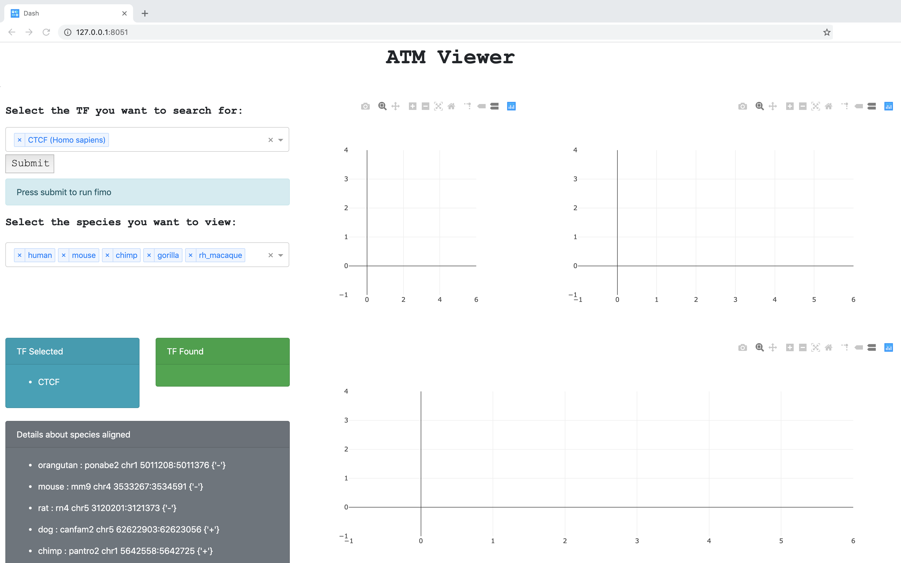
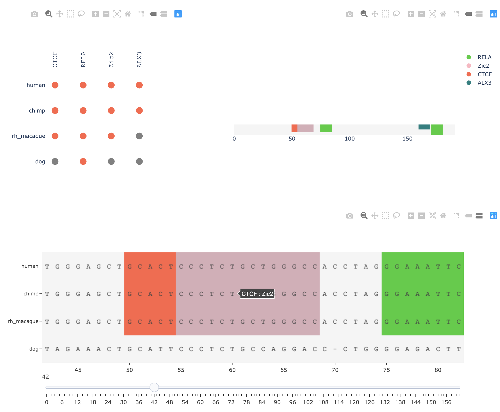
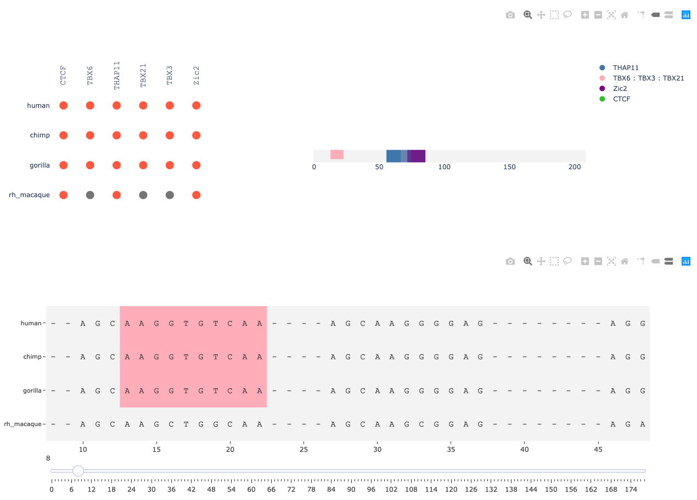

# Motif TurnOver Visualization
------
> **_NOTE:_** Everything will be resized according to screen size of the device used to visualize, better visualization in larger screen.
------
This program is mainly designed to visualize the motif turnover events provided the **Multiple Alignment Format(MAF)** file. It will extract the sequences from block alignments from all the species, generating a single line sequence file which will be used for the visualization. It will also generate another file, which will be used to run fimo from meme to scan for the transcription factors (TF) selected by user. And based on the position of found motif, the sequences will be highlighted by specific color for specific TF. The user will have flexibility to choose how many TFs you want to find and how many species you want to view at a time. The program will also support the alignment file in **clustal format** and **fasta format**. If **fasta format**, make sure there is only one fasta sequence in the file. You can provide multiple fasta sequence in one file, but the length of sequence has to be the same.

> **_NOTE:_** If too many TFs are selected, it might be over-crowded and one TF may be overlapped by another, showing only the top motif

<br/>

# Contents
- [Getting Started](#1-getting-started)
- [Prerequisites](#2-prerequisites)
- [Running the program](#3-running-the-program)
- [Tutorial Walkthrough](#4-tutorial-walkthrough)
- [Cases for overlapping motifs](#5-cases-for-overlapping-motifs)
- [Transcription Factor Search Limit](#6-transcription-factor-search-limit)

<br/>


## 1) Getting Started

User will need to have installed conda. You can download either of it from the link below:
- [anaconda](https://www.anaconda.com/distribution/)
- [miniconda](https://docs.conda.io/en/latest/miniconda.html)

> **_NOTE:_** Choose python 3.7 version


<br/>

<br/>

## 2) Prerequisites
The dependency file is provided in the repository called ***environment.yml***. You can run following command after installing conda which will automatically download the required packages and create a new environment.

`conda env create -f environment.yml`

After this you can activate the created environment using following command

`conda activate turnover`

If you want to use different name for environment, you can do so by changing the name in ***environment.yml***.

<br/>

- ### Input file

The input file requires the file to be in **MAF format**, which is generated by tool [mafsInRegion](http://hgdownload.cse.ucsc.edu/admin/exe/linux.x86_64/mafsInRegion) found in [UCSC site](http://hgdownload.cse.ucsc.edu/admin/exe/linux.x86_64/). The input can also be in **clustal format**.You can look at the example folder for the input file format.

The command used to generate maf file will look like this:

`mafsInRegion input.bed output.maf multi_species_alignment_file.maf`

The multi species alignment files can be downloaded from [here](http://hgdownload.cse.ucsc.edu/goldenpath/hg19/multiz46way/maf/)

> **_NOTE:_** Currently the input file should be the alignment over only one region, if the maf file generated is based on multiple regions, it will result to incorrect result

<br/>

<br/>

## 3) Running the program
To see all the parameter available you can run `python motif_vis.py -h`, which will give following details:
```
usage: motif_vis.py [-h] [-i INPUT] [-m MOTIF] [-d DIR] [-l LOAD]
                    [-f {maf,clustal,fasta}]

optional arguments:
  -h, --help                show this help message and exit
  -i INPUT, --input INPUT   multiple alignment format file for visualization
  
  -m MOTIF, --motif MOTIF   user defined motif, must be in meme format
  
  -d DIR, --dir DIR         folder name for the temporary files generated during
                            the process
                            
  -l LOAD, --load LOAD      automatically opens browser if value is true
  
  -f {maf,clustal,fasta}, --format {maf,clustal,fasta}
                        format of the alignment file
```
The program has 5 parameters:
- **input** : takes the input file in maf format, if nothing is provided it will run the example 
<br/>

- **motif** : takes the custom motif file from user, if you don't need to provide your own motif, you can ignore this parameter. The custom motif file has to be in meme format. You can look at the sample in example_files folder. For each motif, the line above Position Weight Matrix (PWM) has to start with MOTIF followed by motif id (such as M1, M2,..) and then motif name. [click here for example](data/images/pwm_example.png)
<br/>

- **dir**  : directory for the temporary files generated while running the program, if nothing is provided, it will create a default directory named *motif_vis_temp_files*
<br/>

- **load**  : default value is True, which means it it automatically load the browser, if set to False, user would have to copy and paste the address in the browser bar
<br/>

- **format**: defualt value is multiple alignment format (MAF), but if you have alignment file in clustal or fasta format, you can specify by passing parameter 'clustal' as `-f clustal` or 'fasta' as `-f fasta`

Here is the example of the syntax:

```
python motif_vis.py -i example_files/example.maf -d motif_vis_temp_files -l True -f maf
OR
python motif_vis.py

# both of this command will run the example file, if you have your own data, change filename in -i parameter
```

> **_NOTE:_** make sure the fasta file has species name above the aligned sequence such as hg for human, mm for mouse, pantro for chimp etc. as shown in the example file. If the species name is missing, the result will be empty. Example file is provided in example folder. Also make sure clustal file also has the species name.

<br/>

<br/>

## 4) Tutorial Walkthrough

After the program is loaded in the brower, this is what it would look like



By default it has CTCF as selected TF, and human, mouse, chimp and rhesus macaque as species.On the left box of TF selected, it shows what TF has been selected by user, and on right box of TF found, after the user clicks submit button, it will show what TF is found. The grey box on the bottom lists all the species that was found in your input file and the information associated with it.

<br/>

- ### Selecting Options
You can click on the box and it will show different options, you can scroll through the options or just type it, and the TF matching your search will appear. Currently, the user can search through 1,777 non-redundant motifs taken from [JASPAR database 2020](http://jaspar.genereg.net/downloads/) which includes the vertebrates and insects.


<br/>

- ### Visualizing the motif
If you click the submit button, the information below will be changed if the program runs successfully and `Fimo run completed` message will be show, and the plot will be shown on the right side. There are 3 plots on the right side, **first plot** on top shows overview of presence or absence of TF in selected species, red means present and grey means absent. The **second plot** gives bird's-eye view of whole alignment. And the **third plot** on the bottom, gives the more detail visualization regarding the alignment and respective TFs. You can slide the slider to move to the region of your interest. Above the figure there is an option to download or zoom in or zoom out.


<br/>


<br/>

## 5) Cases for overlapping motifs

If the motifs overlap with each other then color of one motif overlays with another, in that case, it might be difficult to see which part of the sequence is overlapped. So, for that you can hover your mouse over the sequence, and it will show the name of both motifs if there is overlapping region.
- ### Example 1 (Partial overlap)
In the figure below you can see, the mouse is over the overlapping sequence which is slitly dimmer and it is showing the names for both TF, you move the mouse towards the end of colored sequence on either side, it will show either CTCF or THAP11.


<br/>

<br/>

In the figure below, Zic2 completely overlaps with CTCF, and the region unique to CTCF is shown by greenish color and the overap by bluish color as in label. Hovering the mouse over sequence will also show the names of overlapping TF.

<br/>

<br/>

In this figure below, there is overlap between three TFs (THAP11, CTCF and Zic2). Here is CTCF is either overlapped with THAP11 or wih Zic2 or both, there is no unique region for CTCF that is not overlapped. So, although in the label, CTCF is represented as green color, the color is not reprsented. And you can see three different color patterns over there each representing THAP11, THAP11+CTCF, THAP11+CTCF+Zic2 and CTCF+Zic2 from left to right in order.

<br/>

<br/>

- ### Example 2 (Complete Overlap)
If there is complete overlap, then combined legend will be shown in the figure bar as shown below for TBX6 and TBX21



<br/>

## 6) Transcription Factor Search Limit
In the program, you can select as many TF as you want, but the color labelling is set to 14 unique TFs, so that each TF has a distinct color. For example, if you select 20 TFs and there is presence of no more than 14 unique TFs in your sequence it will work, but if found number of TFs is more than 14, then program is give an error.
```
These are some of the TFs present in example.maf:
CTCF, ALX3, THAP11, Zic2, TBX6, TBX21, TBX3, RELA, RELB
```

> **_NOTE:_** Also, if there are multiple TF overlap at same region, it is recommended to select maximum of 3 TFs at that region (in total it can be more, but limit the TF in overlapping region), otherwise, the color representation will differ due to increased overlapping. It will be best if you view two overlapping TFs at a time
