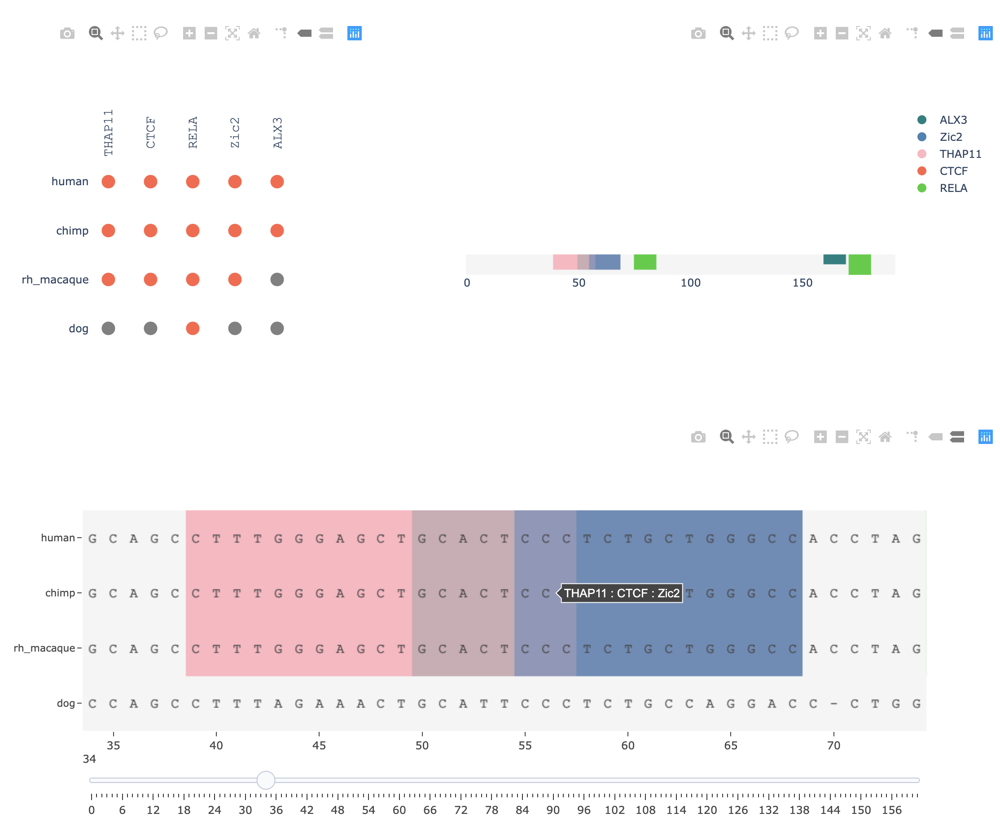

# Motif TurnOver Visualization

------
This program can be used to visualize the motifs provided the Multiple Alignment Format(MAF) file. It will extract the sequences from block alignments from all the species, generating a single line sequence file which will be used for the visualization. It will also generate another file, which will be used to run fimo from meme to scan for the transcription factors (TF) selected by user. And based on the position of found motif, the sequences will be highlighted by specific color for specific TF. The user will have flexibility to choose how many TFs you want to find and how many species you want to view at a time.

> **_NOTE:_** If too many TFs are selected, it might be over-crowded and one TF may be overlapped by another, showing only the top motif

<br/>

## 1) Getting Started

User will need to have installed conda. You can download either of it from the link below:
- [anaconda](https://www.anaconda.com/distribution/)
- [miniconda](https://docs.conda.io/en/latest/miniconda.html)

> **_NOTE:_** Choose python 3.7 version


<br/>

<br/>

## 2) Prerequisites
The dependency file is provided in the repository called ***environment.yml***. You can run following command after installing conda which will automatically download the required packages and create a new environment.

`conda env create -f environment.yml`

After this you can activate the created environment using following command

`conda activate turnover`

If you want to use different name for environment, you can do so by changing the name in ***environment.yml***.

<br/>

- ### Input file

The input file requires the file to be in MAF format, which is generated by tool [mafsInRegion](http://hgdownload.cse.ucsc.edu/admin/exe/linux.x86_64/mafsInRegion) found in [UCSC site](http://hgdownload.cse.ucsc.edu/admin/exe/linux.x86_64/). You can look at the example folder for the input file format.

The command will look like this:

`mafsInRegion input.bed output.maf multi_species_alignment_file.maf`

The multi species alignment files can be downloaded from [here](http://hgdownload.cse.ucsc.edu/goldenpath/hg19/multiz46way/maf/)

> **_NOTE:_** Currently the input file should be the alignment over only one region, if the maf file generated is based on multiple regions, it will result to incorrect result

<br/>

<br/>

## 3) Running the program

The program has 3 parameters:
- **input** : takes the input file in maf format, if nothing is provided it will run the example 
<br/>

- **dir**  : directory for the temporary files generated while running the program, if nothing is provided, it will create a default directory named *motif_vis_temp_files*
<br/>

- **load**  : default value is True, which means it it automatically load the browser, if set to False, user would have to copy and paste the address in the browser bar
<br/>

- **format**: defualt value is multiple alignment format (MAF), but if you have alignment file in clustal format, you can specify by passing parameter 'clustal' as `-f clustal`

Here is the example of the syntax:

```
python motif_vis.py -i example/example.maf -d motif_vis_temp_files -l True -f maf
OR
python motif_vis.py

# both of this command will run the example file, if you have your own data, remove filename in -i parameter
```

> **_NOTE:_** make sure the clustal alignment file has species name above the aligned sequence such as hg for human, mm for mouse, pantro for chimp etc. If the species name is missing, the result will be empty. Example file is provided in example folder.

<br/>

<br/>

## 4) Tutorial Walkthrough

After the program is loaded in the brower, this is what it would look like


By default it has CTCF as selected TF, and human, mouse, chimp and rhesus macaque as species.On the left box of TF selected, it shows what TF has been selected by user, and on right box of TF found, after the user clicks submit button, it will show what TF is found. The grey box on the bottom lists all the species that was found in your input file and the information associated with it.

<br/>

- ### Selecting Options
You can click on the box and it will show different options, you can scroll through the options or just type it, and the TF matching your search will appear. Currently, the user can search through 1,777 non-redundant motifs taken from [JASPAR database 2020](http://jaspar.genereg.net/downloads/) which includes the vertebrates and insects.


<br/>

- ### Visualizing the motif
If you click the submit button, the information below will be changed if the program runs successfully and `Fimo run completed` message will be show, and the plot will be shown on the right side. You can slide the slider to move to the region of your interest. Above the figure there is an option to download or zoom in or zoom out.


<br/>


<br/>

## 5) Cases for overlapping motifs

If the motifs overlap with each other then color of one motif overlays with another, in that case, it might be difficult to see which part of the sequence is overlapped. So, for that you can hover your mouse over the sequence, and it will show the name of both motifs if there is overlapping region.
- ### Example 1 (Partial overlap)
In the figure below you can see, when the mouse is over the overlapping sequence, its showing the names for both TF, you move the mouse towards the end of colored sequence on either side, it will show either CTCF ot THAP11


<br/>


<br/>


<br/>

<br/>


- ### Example 2 (Complete Overlap)
If there is complete overlap, then combined legend will be shown in the figure bar as shown below for TBX6 and TBX21

